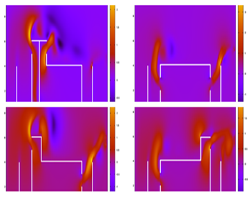
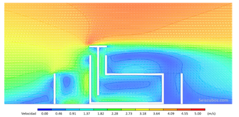

# Ventilación natural en cavidades usando FVM y SIMPLEC

Este repositorio contiene un proyecto de simulación de **flujo en cavidades con ventilación natural**, implementado en **Fortran** usando el método de volúmenes finitos y el algoritmo **SIMPLEC**.

## 📂 Estructura

- **docs/**
  - `reporte.pdf`: informe completo del proyecto.
  - `imagenes/`: figuras clave extraídas del reporte para visualización rápida.
- **src/**: códigos Fortran (4 casos distintos de geometría).
- **data/raw/**: resultados generados por cada uno de los códigos.

## 🖼 Ejemplos de resultados

### Campo de velocidades

### Diferentes configuraciones

## 📜 Notas

- Cada código Fortran (`src/case_X.f90`) corresponde a una configuración de obstáculos distinta.
- Los resultados listados en `data/raw/` se corresponden con las salidas directas de cada ejecución.
- Las imágenes (`docs/imagenes/`) se incluyen para visualización rápida en GitHub, sin necesidad de abrir el PDF.
